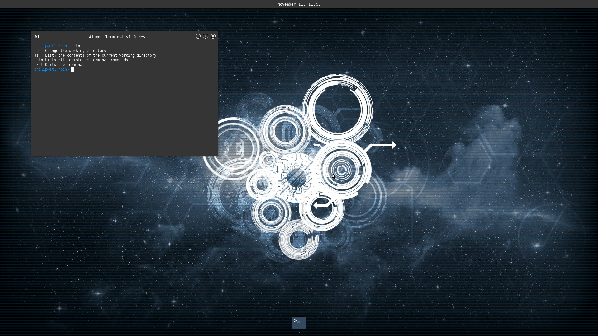
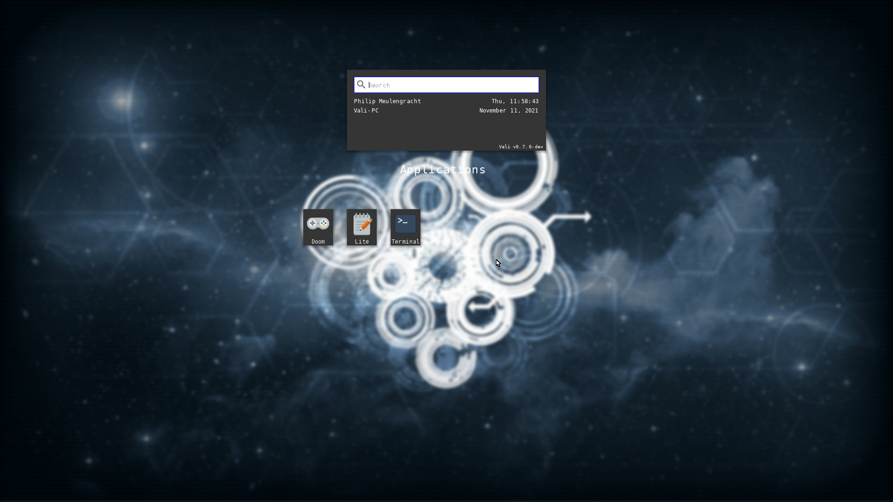
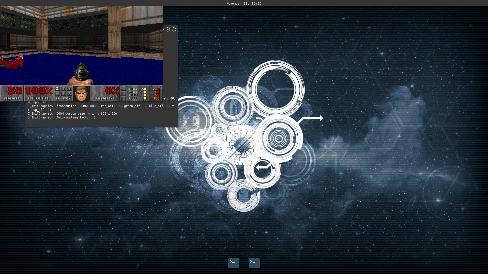

# The Mollen(/Vali) Operating System 

| Platform | Nightly Image (.img)                                                                        | Status                                                                                           |
|----------|---------------------------------------------------------------------------------------------|:-------------------------------------------------------------------------------------------------|
| I386     | [Builds](https://github.com/Meulengracht/MollenOS/actions/workflows/vali-i386-nightly.yml)  |    |
| AMD64    | [Builds](https://github.com/Meulengracht/MollenOS/actions/workflows/vali-amd64-nightly.yml) |  |


## Table of Contents

1. [About](#about)
2. [Getting started](#getting-started)
    1. [Environmental variables](#env-variables)
    2. [Setting up the toolchain](#setting-up-toolchain)
    3. [Setting up for OS development](#setting-up-devenv)
    4. [Setting up for application development](#setting-up-app-devenv)
    5. [The build options for cmake](#build-options)
    6. [The build commands](#build-commands)
    7. [Known issues](#known-issues)
3. [Contributing](#contributing)
    1. [Submitting issues](#contrib-issues)
    2. [PRs](#contrib-pr)
4. [Features](#features)
    1. [Bootloader](#features-boot)
    2. [Kernel](#features-kernel)
    3. [Services](#features-services)
    4. [Drivers](#features-drivers)
5. [Documentation](#documentation)
    1. [Architecture](#doc-system-arch)
    2. [Project structure](#doc-project-structure)

## About <a name="about"></a>





MollenOS Discord Server: https://discord.gg/kgQ5uD2mH2

### Noteable projects

| Project | Link                                                |                           Description                            |
|---------|:----------------------------------------------------|:----------------------------------------------------------------:|
| Gracht  | [github](https://github.com/Meulengracht/libgracht) |       Protocol library heavily featured in MollenOS/Vali.        |
| Vioarr  | [github](https://github.com/Meulengracht/vioarr)    | Window manager with terminal and launcher built ontop of Gracht. |

## Getting started <a name="getting-started"></a>

### Environment variables <a name="env-variables"></a>
Before you set up anything you must set up environmental variables that are used by
the project. This is only true if you do not do development with a docker container.

| Variable              | Required |                        Description                         |
|-----------------------|:---------|:----------------------------------------------------------:|
| CROSS                 | Yes      |      Points to where the cross-compiler is installed.      |
| VALI_APPLICATION_PATH | No\*     | Points to where the Vali applications/libraries are built. |

\* Can be supplied to include built applications in the kernel image

### Setting up the toolchain <a name="setting-up-toolchain"></a>

#### Docker

Fully prepared docker images with a toolchain installed are provided from valios/vali-toolchain. This repository
comes with a Dockerfile that you can use to build the OS with. You can also include the userspace
by downloading the build .tar file from the userspace repository and keep it in
the same folder as you run the docker command. Then docker will include it when you build an image file.

Building the OS with no artifacts
```
docker build --build-arg ARCH={i386,amd64} --file build.Dockerfile .
```

Building an .img file locally with docker and export it to host:
```
DOCKER_BUILDKIT=1 docker build --build-arg ARCH={i386,amd64} --output type=local,dest=build --file nightly.Dockerfile .
```

#### Local (from source)
The only thing you need to get started is a succesfully built (custom) toolchain of llvm/clang/lld. To help make this easier
I have made a fully automated script, which downloads all the neccessary components, and initiates a full build of llvm/lld/clang.
Make note that a full build of llvm/clang/lld need to run, and that this takes a couple of hours.

Toolchain scripts are located [here](https://github.com/Meulengracht/vali-toolchain). You should run the scripts in this order:
- depends.sh
- checkout.sh
- build-cross.sh

If you are not on Linux, you should download the llvm-project git and build it yourself using the cmake command
```
cmake -S llvm -B build -G "Unix Makefiles" 
   -DLLVM_TEMPORARILY_ALLOW_OLD_TOOLCHAIN=True
   -DLLVM_ENABLE_PROJECTS='clang;clang-tools-extra;libcxx;libcxxabi;libunwind;lldb;compiler-rt;lld'
   -DCMAKE_BUILD_TYPE=Release
   -DLLVM_INCLUDE_TESTS=Off
   -DLLVM_INCLUDE_EXAMPLES=Off
   -DCMAKE_INSTALL_PREFIX=/path/to/install
   -DLLVM_DEFAULT_TARGET_TRIPLE=amd64-uml-vali
```

### Setting up for OS development <a name="setting-up-devenv"></a>
Remember to check out all the submodules with the command git submodule update --init --recursive

The last step is now to run the depends.sh script that is located in this repository which installs
the final pre-requisites (nasm, dotnet, cmake platform script). The script is located in tools/depends.sh.

After this, you are essentially ready to start developing on the operating system. When/if you make pull requests
when contributing, please follow the pull template that is provided.

### Setting up for application development <a name="setting-up-app-devenv"></a>
Just building this repository is not enough for the full OS experience. You need to checkout the userspace
repository that contains C++ runtime and applications and build those as well. For this you need to have the
SDK/DDK installed (```make install``` - remember to set CMAKE_INSTALL_PREFIX when configuring) and
the appropriate environmental variables' setup. Then the command ```make install_{img,vmdk}``` will automatically
pull in all built applications and libraries into the OS image.

| Option        |                                  Description                                  |
|---------------|:-----------------------------------------------------------------------------:|
| VALI_SDK_PATH | The path to the installed SDK, usually where Vali is installed with /vali-sdk |
| VALI_DDK_PATH | The path to the installed DDK, usually where Vali is installed with /valk-ddk |

Then follow the instructions located [here](https://github.com/Meulengracht/vali-userspace) to get the sources for the applications.

### The build option for cmake <a name="build-options"></a>
These are highlighted build configuration options for the cmake generation, there are more options, but these are the most often configured.

| Option                   | Default Value |                                         Description                                          |
|--------------------------|:-------------:|:--------------------------------------------------------------------------------------------:|
| VALI_ARCH                |     i386      | Which architecture you will build the OS and applications for. Supported are i386 and amd64. |
| VALI_ENABLE_KERNEL_TRACE |      ON       |                             Enable debug tracing in the kernel.                              |
| VALI_ENABLE_SMP          |      ON       |                           Enable multicore support in the kernel.                            |

### The build commands <a name="build-commands"></a>
There is a series of build commands available.

| Command           |                                                       Description                                                        |
|-------------------|:------------------------------------------------------------------------------------------------------------------------:|
| make              |                                    Builds the operating system and support libraries                                     |
| make install      | Installs the SDK and DDK to the location pointed by CMAKE_INSTALL_PREFIX. This is needed for app and driver development. |
| make install_img  |                Creates a harddisk image with bootloader, kernel, libraries and built apps of format .img                 |
| make install_vmdk |                Creates a harddisk image with bootloader, kernel, libraries and built apps of format .vmdk                |

### Known issues <a name="known-issues"></a>

#### Bochs
The uhci driver in bochs (2.6.9) defers packages when communicating with MSD devices to fake a seek delay,
however this results in issues with reading from the harddisk, since bochs does not correctly store the number
of deferred packages. See this issue description [here](https://forum.osdev.org/viewtopic.php?f=1&t=32574&start=0).

## Contributing <a name="contributing"></a>

I appreciate any form for contribution you want to make to the project! The project is purely driven by passion, and I dedicate any and all available spare time to this project. But to take this project to the next level I need support! Contributions of any kind are deerly welcome, but should follow the below guidelines.

You can start contributing on any aspect of the operating system, and if you should ever be in doubt, feel free to email me at phailmollen@gmail.com.

### Submitting issues <a name="contrib-issues"></a>

When submitting issues, please take care that the issue is not a dublicate of an already existing, open issue. Please follow the templates specified for issues. Issues can be either a bug report or a feature request. If you feel like the feedback/issue you have does not fall into either category, pick the one you feel it fits the most.

### Pull Requests <a name="contrib-pr"></a>

If you want to contribute as a developer on the project please fork the repository, and contribute via pull requests. There is a pull request template you can use when creating a pull request. Please allow for a day or two for me to review the pull request before accepting, as I will take a look as quickly as possible and submit your pull request.

## Features <a name="features"></a>

### Bootloader <a name="features-boot"></a>
MollenOS uses its own filesystem (MFS), it is not booted by the 
more traditional way of GRUB. Instead, it has its own faily 
complete bootloader for BIOS and UEFI, which can be found in the /boot 
directory. VBoot is written specifically for MollenOS, and 
supports booting from both FAT32 & MFS.

### Kernel <a name="features-kernel"></a>
The Vali kernel is far from feature-complete, but it currently is in a state where it supports our use-cases. The kernel itself provides some basic system management functions like;
 - Memory management
 - Thread management
 - IPC
 - Module support system
 - ACPI

Rest of the system functionality exists as drivers and services.

## Services <a name="features-services"></a>
The current services that are implemented (and at some point when we implement RiscV/ARM architectures) should be included as configurable in the build system, so we can choose exactly which services are relevant for the platform.
 - Device manager (handles discovery and management of devices on the platform)
 - File manager (Is responsible for both storage and file management)
 - Net manager (Network stack and management of sockets)
 - Process manager (Provides the process protocol that allows spawning and management of processes on the system)
 - Session manager (Provides management of user sessions)
 - Usb manager (The usb stack implementation that manages usb devices, hubs and controllers)

## Drivers <a name="features-drivers"></a>
    - AHCI
    - ACPICA
    - MFS
    - HPET
    - USB Stack (OHCI, UHCI, EHCI)
    - USB Hub
    - USB MSD
    - USB HID
    - (x86) PCI/PCIe
    - (x86) CMOS
    - (x86) PIT
    - (x86) RTC
    - (x86) PS2 Mouse & Keyboard
    - (x86) APIC

## Documentation <a name="documentation"></a>

All documentation about design and implementation, and the theory behind is stored in the `/docs` folder. Right now there isn't any documentation, but it'll all come with the Documentation milestone.

### Architecture <a name="doc-system-arch"></a>


### Project structure <a name="doc-project-structure"></a>

- /apps (Contains userspace utilities that are bound to the OS)
- /boot (Contains bootloaders and anything boot-related)
- /cmake (CMake configuration files required to build the OS with cmake)
- /docs (Documentation and related resources about the project and the OS)
- /kernel (Contains the Vali kernel source code)
- /librt (Contains all support and runtime libraries needed for Vali)
- /modules (Contains drivers for Vali)
- /protocols (All the libgracht protocols used in the OS for services and modules)
- /services (Contains system services like the filemanager for Vali)
- /resources (Contains the deployment folder for installing the OS)
- /tools (Contains tools for building and manipulating)
